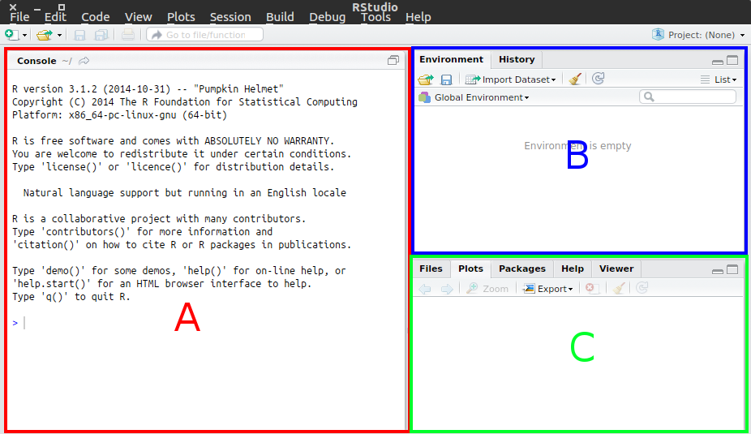

# Purpose

Through out the workshop we will be using R and R Studio. This document walks the participants through the steps necessary to download and install required software.

R is a free, open source statistical computing environment. It is very popular these days to conduct all sorts of data manipulation and analysis tasks. 

R studio is an integrated development environment that eases using R. We will be using it to (1) ease learning, (2) provide high quality reports.

# Table of Contents
1. [Installing R](#-Installing-R)
2. [Installing R Studio](#-Installing-R-Studio)
3. [Testing](#Testing)
4. [Installing Packages](#Installing-Packages)

# Installing R.

A new version of R is released twice a year, thus the exact version available at the time may change. At the time of the writing, the latest version of R was 3.2.3 (December 2015). For our purposes the exact version does not matter. Just download the latest version available in Comprehensive R Archive Network[^Cranfoot] (CRAN).

[^Cranfoot]: CRAN is the official repository for R and R packages. This is where you typically obtain R.

If you are using Windows or Mac you will want to download and install R binaries from [CRAN](https://cran.r-project.org/).  If you are using Linux, R should be available in the Software Repositories (and you most probably don't need my guidance).

Download the R installer suitable for your operating system below.

**Installers:** 

  [R Windows Installers](https://cran.r-project.org/bin/windows/base/)

  [R Mac OS Installers](https://cran.r-project.org/bin/macosx/)

Install the downloaded files just like you would any other program. Basically this involves you double clicking the downloaded file and following the on screen instructions. I recommend you accept default settings.

# Installing R Studio

[R studio](https://www.rstudio.com/products/rstudio/) is the integrated development environment we will use for our workshop. Think of R Studio as an interface with additional functionality for R. It eases the scripting and documenting of your analysis.

You can get R Studio installer from the links below:

  [R Studio Windows Installers](https://download1.rstudio.org/RStudio-0.99.489.exe)

  [R Studio Mac OS Installers](https://download1.rstudio.org/RStudio-0.99.489.dmg)

 [R Studio Linux Package](https://download1.rstudio.org/rstudio-0.99.489-amd64.deb)

Install the downloaded files just like you would any other program. Basically this involves you double clicking the downloaded file and following the on screen instructions. I recommend you accept default settings.

# Testing

I hope you are getting excited to embark upon your analytics journey with R. Let's have a taste of R by verifying what we did so far works.

Click the icon for R studio .

You should see something like the figure below:

Area A is the interactive R console. You can write R commands here and they will be executed.
Area B is the environment pane. Here you can see the data and models in the R environment.
Area C is the display pane. Here is where the Plots, Help files and such are displayed.

There is one more pane not visible at the moment, the scripting pane. You can write R scripts and R markdown files for later execution in that area.

In R console (Area A) type in the command below and press enter. Make sure you type exactly what you see. R is case sensitive (Print is not the same as print) and is very picky about correct syntax (Quotation marks and braces).

First let us do some basic arithmetic operations

    2+2

You should see [1] 4 in Area A.

Now let us print out a string (piece of text).

    print("Hello World")

If you see [1] "Hello World" in Area A, all is as it should be. 

Type the following command to read R documentation.

    help()

If you see documentation open up in Area C, all is well.

If you want to explore R on your own and prepare for the workshop I can recommend [John Fox's web site](http://socserv.socsci.mcmaster.ca/jfox/Courses/R-programming/index.html). Especially the first two R scripts are good to look through.

# Installing Packages

Paste the following code into the R Console to install packages that will be used in this workshop.

    install.packages(c("pROC", "ggplot2""))

------

 How I Learned to Stop Worrying and Love the R Console by [Irfan E Kanat](http://irfankanat.com) is licensed under a [Creative Commons Attribution 4.0 International License](http://creativecommons.org/licenses/by/4.0/). Based on a work at [http://github.com/iekanat/rworkshop](http://github.com/iekanat/rworkshop).
