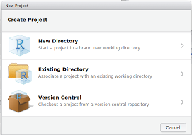

# How I Learned to Stop Worrying and Love the R Console

In this document, we will go through a brief introduction to R console, data.frames and functions. Naturally we will be using R console for this purpose. To many, the command driven interface looks a bit intimidating, however there are good reasons to stick to it.

First of all, command driven interface is very flexible and it is better suited for data manipulation and analysis tasks as a graphical user interface with similar functionality would be hard to navigate and harder to use. Second, a command driven interface allows scripting. In any serious data analysis task, reproducibility is a key concern. A command based analysis environment makes replication of results easier, as it is far easier to record every detail of the configuration used in scripts. Thus, if you are worried about R after seeing R console; it is time to lay your worries to rest and learn to love the R console.

Throughout this document you will see two types of code blocks. First group (exact representation may vary depending on media type) is blue text in light gray boxes. Those are R commands you can type in to the R console. Second group is the black text on white back ground, preceded by ##. Which is the R output of said command. Below is an example.


```r
print("Hello MSBA Students")
```

```
## [1] "Hello MSBA Students"
```

```r
# This is a comment, any line starting with a # sign won't be evaluated by R.
```

## Before Beginning 

From the menu bar, create a new project for our workshop. Follow the steps outlined below:

1. Click File
2. Click New Project
3. In the new project window, select New Directory. 
4. Select empty directory.
5. Make sure you know where the project directory is. I recommend you place your project directory to a place you can easily access and remember (like Documents folder or Home folder). 



Following these steps ensure we can keep building on the same work space over time.

## Getting Your Feet Wet

R console is quite flexible. You can use it for a number of purposes. Below are some basic algebra examples.


```r
5+1
```

```
## [1] 6
```

```r
5-9
```

```
## [1] -4
```

```r
5*2
```

```
## [1] 10
```

```r
5/2
```

```
## [1] 2.5
```

```r
5^3
```

```
## [1] 125
```

```r
log(10)
```

```
## [1] 2.302585
```

```r
# Some logic
3==4 # is 3 equal to 4? Notice double equal signs
```

```
## [1] FALSE
```

```r
3<4 # is 3 less than 4?
```

```
## [1] TRUE
```

As you can see R can serve as a calculator. You can also use R for vector and matrix operations, which I won't be discussing here.

At this point you may be wondering about the [1] prepended to all the results. That is the index of the first item displayed in a row of results. Below I will ask R to output numbers from 1 to 30.


```r
1:30
```

```
##  [1]  1  2  3  4  5  6  7  8  9 10 11 12 13 14 15 16 17 18 19 20 21 22 23
## [24] 24 25 26 27 28 29 30
```

As you can see, in the second row the index shifts to [24] indicating the 24th number in the series.

## Variables

If you want to save anything in the environment to use later; be it a variable, data, results. You can use the assignment operator '<-'


```r
A <- 5
```

Notice there is no output. R merely saved 5 into memory as A. So A is a shortcut (variable) for 5. We can use it in ways displayed below.


```r
A
```

```
## [1] 5
```

```r
A+2
```

```
## [1] 7
```

```r
A*2
```

```
## [1] 10
```

Here it is time to point out to a feature of R console. It is case sensitive.


```r
# a
# Explanation
"a" != "A"
```

```
## [1] TRUE
```

We can also store a vector (array of numbers) in a variable. Here I am saving numbers 1 to 10 in B.


```r
B <- 1:10
```

Notice the lack of output.

You can carry out arithmetic with scalars (single number) and other vectors.


```r
B
```

```
##  [1]  1  2  3  4  5  6  7  8  9 10
```

```r
B*A
```

```
##  [1]  5 10 15 20 25 30 35 40 45 50
```

```r
B+A
```

```
##  [1]  6  7  8  9 10 11 12 13 14 15
```

```r
C<-B+A # let us save B+A into a third variable C
C
```

```
##  [1]  6  7  8  9 10 11 12 13 14 15
```

Nice thing about vectors is you can access variables in a vector through indexes. We know C has numbers from 6 to 15. If I want to access the 3rd element of the vector I can do this as follows:


```r
C[3]
```

```
## [1] 8
```

Here the number between the square braces "[]" is the index. It tells R to extract only the third element. **Indexing is a key point which we will use quite a bit later.**

You can also refer to more than one element at once. Below I refer to elements from second to fourth.


```r
C[2:4]
```

```
## [1] 7 8 9
```

Similarly we can refer to just 3rd and 6th elements.


```r
C[c(3,6)]
```

```
## [1]  8 11
```

You can use logic operators to refer to specific elements. This will come in handy later when you are trying to extract all information before a specific date or all transactions of a customer.

We can see if elements of C are smaller than 10.


```r
C<10
```

```
##  [1]  TRUE  TRUE  TRUE  TRUE FALSE FALSE FALSE FALSE FALSE FALSE
```

We can use this information to extract only elements of C less than 10.


```r
C[C<10]
```

```
## [1] 6 7 8 9
```


## Data Frames

In R data.frame is the typical storage of data. You can think of it as a matrix (two dimensional data structure) that allows different types of variables to be combined. Below I am generating a data.frame. Do not worry too much about how it works at this stage. The important part is how we will refer to elements of the data frame.


```r
fac<-sample(LETTERS[1:3], 10, replace = TRUE)
D<-data.frame(1, 1:10, fac)
D
```

```
##    X1 X1.10 fac
## 1   1     1   B
## 2   1     2   A
## 3   1     3   B
## 4   1     4   A
## 5   1     5   A
## 6   1     6   B
## 7   1     7   A
## 8   1     8   B
## 9   1     9   A
## 10  1    10   A
```

As you can see, the data frame has three variables (X1, X1.10, and fac) in columns and ten observations of each in rows. This is a two dimensional data structure. Meaning we can refer to rows and columns.

Let us get the first three rows. **Notice the ',' between the square brackets. The part before the comma refers to rows, and the part after refers to columns.**


```r
D[1:3,]
```

```
##   X1 X1.10 fac
## 1  1     1   B
## 2  1     2   A
## 3  1     3   B
```

Now let us get just the second and third column.


```r
D[,2:3]
```

```
##    X1.10 fac
## 1      1   B
## 2      2   A
## 3      3   B
## 4      4   A
## 5      5   A
## 6      6   B
## 7      7   A
## 8      8   B
## 9      9   A
## 10    10   A
```

You can refer to rows and columns at the same time.


```r
D[1:3,2:3]
```

```
##   X1.10 fac
## 1     1   B
## 2     2   A
## 3     3   B
```

You can use column names to refer to columns.


```r
D[,"fac"]
```

```
##  [1] B A B A A B A B A A
## Levels: A B
```

```r
# OR Alternately notice the use of $ operator
D$fac
```

```
##  [1] B A B A A B A B A A
## Levels: A B
```

Now think about a situation. Where the third column (fac) is the user ID and you want all transactions of a specific user. We can use the logic operators we learned about earlier to obtain just that. Let us extract the observations relating to user C .


```r
D[D$fac=='C',] # This translates to "From D, select all rows where column fac equals 'C'". 
```

```
## [1] X1    X1.10 fac  
## <0 rows> (or 0-length row.names)
```


## Loops in R

R can be pretty inefficient with loops, try to vectorize your operations and use apply functions instead. After that warning, here is how you loop in R.


```r
for(i in C){print(i)}
```

```
## [1] 6
## [1] 7
## [1] 8
## [1] 9
## [1] 10
## [1] 11
## [1] 12
## [1] 13
## [1] 14
## [1] 15
```


## Functions

So now you know about assignment operators (<-, ->, =), logical operators (==, <, >, ...), variables and data.frames. Learning about functions will conclude our introduction to R console, and enable us to explore more exciting dimensions of analytics with R.

A basic R function is just a word followed by parentheses. Between the brackets are the options (parameters) of the function. The function below prints R license information to the screen. It takes no parameters.


```r
license() #Source of the virus
```

```
## 
## This software is distributed under the terms of the GNU General
## Public License, either Version 2, June 1991 or Version 3, June 2007.
## The terms of version 2 of the license are in a file called COPYING
## which you should have received with
## this software and which can be displayed by RShowDoc("COPYING").
## Version 3 of the license can be displayed by RShowDoc("GPL-3").
## 
## Copies of both versions 2 and 3 of the license can be found
## at https://www.R-project.org/Licenses/.
## 
## A small number of files (the API header files listed in
## R_DOC_DIR/COPYRIGHTS) are distributed under the
## LESSER GNU GENERAL PUBLIC LICENSE, version 2.1 or later.
## This can be displayed by RShowDoc("LGPL-2.1"),
## or obtained at the URI given.
## Version 3 of the license can be displayed by RShowDoc("LGPL-3").
## 
## 'Share and Enjoy.'
```

If you want to see the source code of any function, just type its name without the braces. This way you can see how existing functions work, and hopefully later debug, and develop your own functions.


```r
license
```

```
## function () 
## {
##     cat("\nThis software is distributed under the terms of the GNU General\n")
##     cat("Public License, either Version 2, June 1991 or Version 3, June 2007.\n")
##     cat("The terms of version 2 of the license are in a file called COPYING\nwhich you should have received with\n")
##     cat("this software and which can be displayed by RShowDoc(\"COPYING\").\n")
##     cat("Version 3 of the license can be displayed by RShowDoc(\"GPL-3\").\n")
##     cat("\n")
##     cat("Copies of both versions 2 and 3 of the license can be found\n")
##     cat("at https://www.R-project.org/Licenses/.\n")
##     cat("\n")
##     cat("A small number of files (the API header files listed in\n")
##     cat("R_DOC_DIR/COPYRIGHTS) are distributed under the\n")
##     cat("LESSER GNU GENERAL PUBLIC LICENSE, version 2.1 or later.\n")
##     cat("This can be displayed by RShowDoc(\"LGPL-2.1\"),\n")
##     cat("or obtained at the URI given.\n")
##     cat("Version 3 of the license can be displayed by RShowDoc(\"LGPL-3\").\n")
##     cat("\n")
##     cat("'Share and Enjoy.'\n\n")
## }
## <bytecode: 0x8912670>
## <environment: namespace:base>
```

Some functions (the most useful ones) take parameters. Here I am asking R to calculate the mean of numbers in vector C. C serves as a parameter to tell the mean function over which numbers to calculate the mean.


```r
mean(C)
```

```
## [1] 10.5
```

You can directly use the output of one function with another. Here I will calculate the mean by first summing the C vector then dividing the sum by number of elements.


```r
sum(C)/length(C)
```

```
## [1] 10.5
```

Functions can take more than one parameter. Here I am instructing R to calculate mean, after trimming the extreme values (10% of the data).


```r
mean(C, trim = .10)
```

```
## [1] 10.5
```

If you want to learn what a function does, or what parameters are available, use help function.


```r
help(mean)
```

You can also create your own functions by saving them in a variable. Below I declare a hello function that takes a string, or number and prints out a hello message.


```r
# Declare function
hello<-function(x){print(paste("Hello ",x))}
# Use function
hello('MSBA')
```

```
## [1] "Hello  MSBA"
```

```r
# View source
hello
```

```
## function(x){print(paste("Hello ",x))}
```

Here I declare two parameters with the default value of the second parameter set to 1.


```r
hello<-function(x,y=1){
  for(i in 1:y){
    print(paste("Hello ",x))    
  }
}

hello('World')
```

```
## [1] "Hello  World"
```

```r
hello('World', 3)
```

```
## [1] "Hello  World"
## [1] "Hello  World"
## [1] "Hello  World"
```


## Scripts and Markdown Documents

Scripts (.R) and R Markdown (.Rmd) documents enable you to save your work flow in a reproducible fashion.

An adaptation of markdown format to R, the Rmd file format allows for presentable reporting of R analysis. All documents you encounter in relation to this workshop has been generated with R markdown. If you are preparing a report to be presented, Rmd is the format you should aim for. Refer to ['R Markdown Cheat Sheet'](https://www.rstudio.com/wp-content/uploads/2015/02/rmarkdown-cheatsheet.pdf) for more information on this format.

If you have no concerns for presentation and just want to automate a process you can basically write your commands in a text file and change the extension to .R, thus achieving an R script file. You can then ask R to execute this file in the command line as seen below, thus repeating the process detailed in the script. This is good for automating work flows.

```
R CMD BATCH my_script.R
```


This concludes our introduction.

------

 How I Learned to Stop Worrying and Love the R Console by [Irfan E Kanat](http://irfankanat.com) is licensed under a [Creative Commons Attribution 4.0 International License](http://creativecommons.org/licenses/by/4.0/). Based on a work at [http://github.com/iekanat/rworkshop](http://github.com/iekanat/rworkshop).
